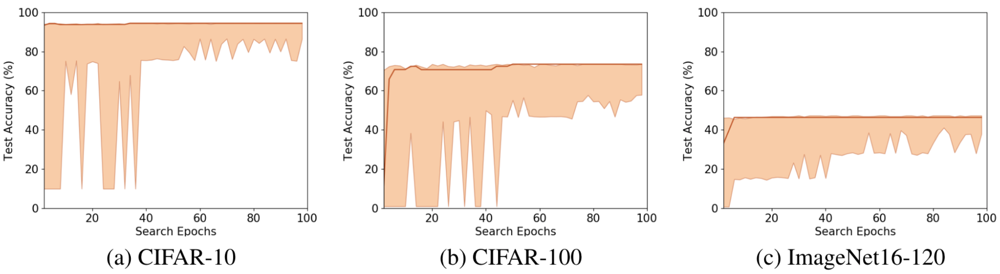

# DrNAS


## About
Code accompanying the paper  
[ICLR'2021](https://iclr.cc/): ***DrNAS: Dirichlet Neural Architecture Search*** [paper](https://openreview.net/forum?id=9FWas6YbmB3)  
Xiangning Chen*, Ruochen Wang*, Minhao Cheng*, Xiaocheng Tang, Cho-Jui Hsieh

This code is based on the implementation of [NAS-Bench-201](https://github.com/D-X-Y/AutoDL-Projects) and [PC-DARTS](https://github.com/yuhuixu1993/PC-DARTS).

This paper proposes a novel differentiable architecture search method by formulating it into a distribution learning problem. We treat the continuously relaxed architecture mixing weight as random variables, modeled by Dirichlet distribution. With recently developed pathwise derivatives, the Dirichlet parameters can be easily optimized with gradient-based optimizer in an end-to-end manner. This formulation improves the generalization ability and induces stochasticity that naturally encourages exploration in the search space. Furthermore, to alleviate the large memory consumption of differentiable NAS, we propose a simple yet effective progressive learning scheme that enables searching directly on large-scale tasks, eliminating the gap between search and evaluation phases. Extensive experiments demonstrate the effectiveness of our method. Specifically, we obtain a test error of **2.46%** for CIFAR-10, **23.7%** for ImageNet under the mobile setting. On NAS-Bench-201, we also achieve **state-of-the-art** results on all three datasets and provide insights for the effective design of neural architecture search algorithms.


## Results

### On NAS-Bench-201
The table below shows the test accuracy on NAS-Bench-201 space. We achieve the state-of-the-art results on all three datasets.
On CIFAR-100, DrNAS even achieves the global optimal with no variance!

| Method      | CIFAR-10 (test) | CIFAR-100 (test) | ImageNet-16-120 (test) |
|    :---:    |    :----:   |  :---: |  :---: |
|    ENAS    |     54.30 &pm; 0.00   | 10.62 &pm; 0.27 | 16.32 &pm; 0.00 |
|    DARTS   |     54.30 &pm; 0.00   | 38.97 &pm; 0.00 | 18.41 &pm; 0.00 |
|    SNAS    |     92.77 &pm; 0.83   | 69.34 &pm; 1.98 | 43.16 &pm; 2.64 |
|   PC-DARTS |     93.41 &pm; 0.30   | 67.48 &pm; 0.89 | 41.31 &pm; 0.22 |
|DrNAS (ours)|     **94.36 &pm; 0.00**   | **73.51 &pm; 0.00** | **46.34 &pm; 0.00** |
|   optimal  |     94.37 | 73.51 | 47.31 |

For every search process, we sample 100 architectures from the current Dirichlet distribution and plot their accuracy range along with the current architecture selected by Dirichlet mean (solid line).
The figure below shows that the accuracy range of the sampled architectures starts very wide but narrows gradually during the search phase. It indicates that DrNAS learns to encourage exploration at the early stages and then gradually reduces it towards the end as the algorithm becomes more and more confident of the current choice.
Moreover, the performance of our architectures can consistently match the best performance of the sampled architectures, indicating the  effectiveness of DrNAS.



### On DARTS Space (CIFAR-10)
DrNAS achieves an average test error of 2.46%, ranking top amongst recent NAS results.

| Method      | Test Error (%) | Params (M) | Search Cost (GPU days) |
|    :---:    |    :----:   |  :---: |  :---: |
|    ENAS    |     2.89   | 4.6 | 0.5 |
|    DARTS   |     2.76 &pm; 0.09  | 3.3 | 1.0 |
|    SNAS    |     2.85 &pm; 0.02   | 2.8 | 1.5 |
|   PC-DARTS |     2.57 &pm; 0.07   | 3.6 | 0.1 |
|DrNAS (ours)|     2.46 &pm; 0.03   | 4.1 | 0.6 |


### On DARTS Space (ImageNet)
DrNAS can perform a direct search on ImageNet and achieves a top-1 test error below 24.0%!

| Method      | Top-1 Error (%) | Params (M) | Search Cost (GPU days) |
|    :---:    |    :----:   |  :---: |  :---: |
|    DARTS<sup>*<sup>   |     26.7  | 4.7 | 1.0 |
|    SNAS<sup>*<sup>    |     27.3  | 4.3 | 1.5 |
|   PC-DARTS |     24.2  | 5.3 | 3.8 |
|   DSNAS    |     25.7  |     -    |   -   |
|DrNAS (ours)|     23.7   | 5.7 | 4.6 |

<sup>*<sup> not a direct search


## Usage


### Architecture Search

**Search on NAS-Bench-201 Space: (3 datasets to choose from)**

* Data preparation: Please first download the 201 benchmark file and prepare the api follow [this repository](https://github.com/D-X-Y/NAS-Bench-201).

* ```cd 201-space && python train_search.py```
* ```With Progressively Pruning: cd 201-space && python train_search_progressive.py```

**Search on DARTS Space:**

* Data preparation: For a direct search on ImageNet, we follow [PC-DARTS](https://github.com/yuhuixu1993/PC-DARTS) to sample 10% and 2.5% images for earch class as train and validation.

* ```CIFAR-10: cd DARTS-space && python train_search.py```

* ```ImageNet: cd DARTS-space && python train_search_imagenet.py```

### Architecture Evaluation

* ```CIFAR-10: cd DARTS-space && python train.py --cutout --auxiliary```

* ```ImageNet: cd DARTS-space && python train_imagenet.py --auxiliary```


## Reference
If you find this code useful in your research please cite
```
@inproceedings{chen2021drnas,
    title={Dr{\{}NAS{\}}: Dirichlet Neural Architecture Search},
    author={Xiangning Chen and Ruochen Wang and Minhao Cheng and Xiaocheng Tang and Cho-Jui Hsieh},
    booktitle={International Conference on Learning Representations},
    year={2021},
    url={https://openreview.net/forum?id=9FWas6YbmB3}
}
```


## Related Publications

* Xiangning Chen, Cho-Jui Hsieh. [Stabilizing Differentiable Architecture Search via Perturbation-based Regularization](http://proceedings.mlr.press/v119/chen20f.html). ICML 2020. [Code](https://github.com/xiangning-chen/SmoothDARTS).
* Ruochen Wang, Minhao Cheng, Xiangning Chen, Xiaocheng Tang, Cho-Jui Hsieh. [Rethinking Architecture Selection in Differentiable NAS](https://openreview.net/forum?id=PKubaeJkw3). ICLR 2021 (oral). [Code](https://github.com/ruocwang/darts-pt).
